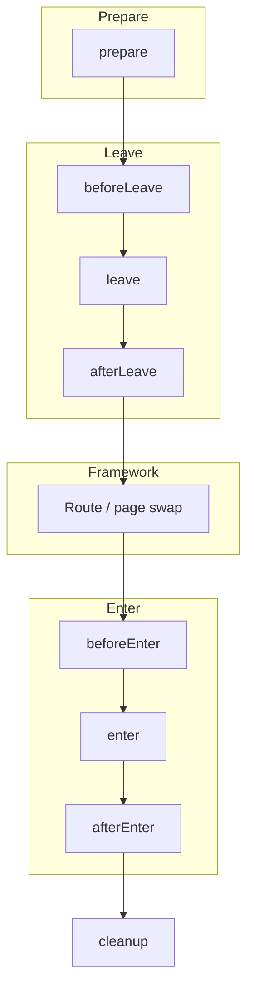
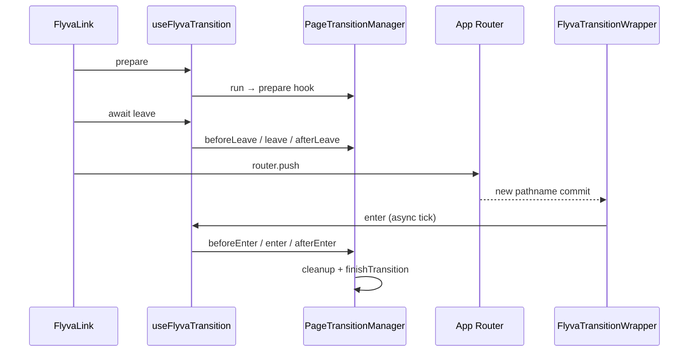
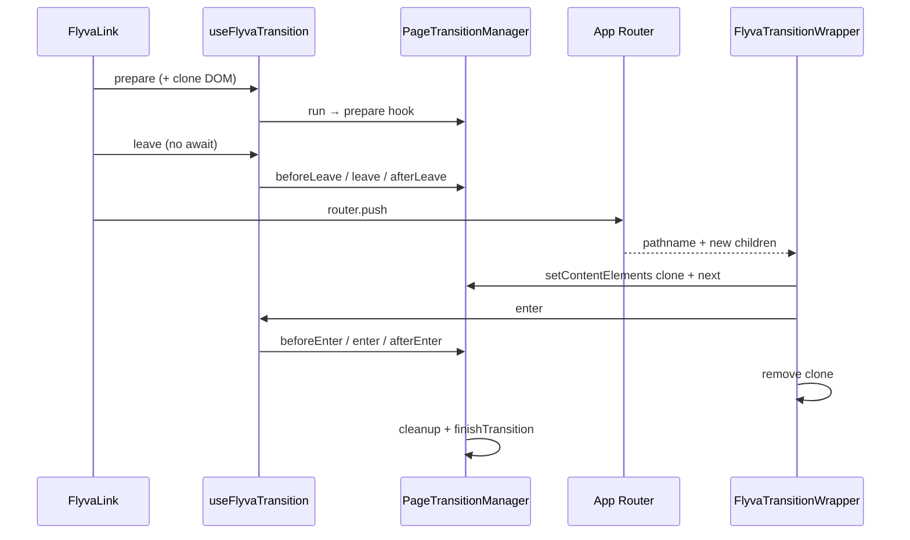
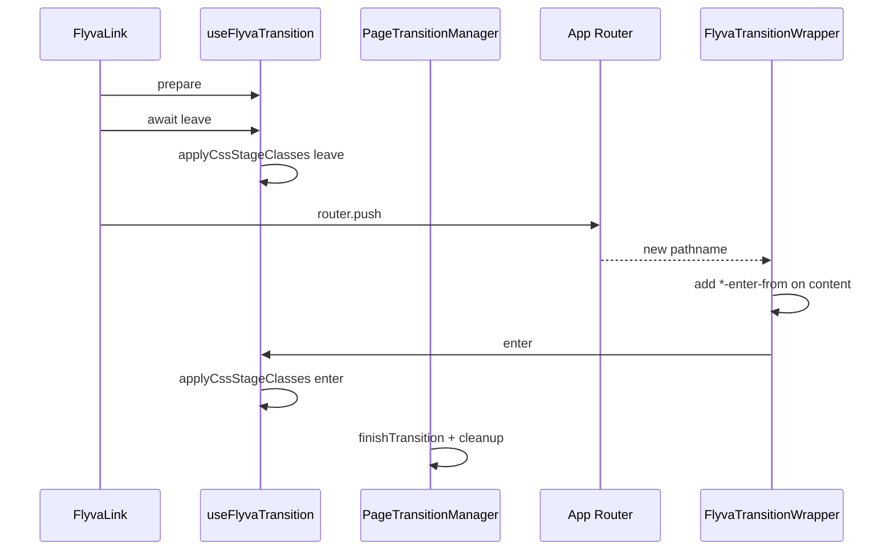
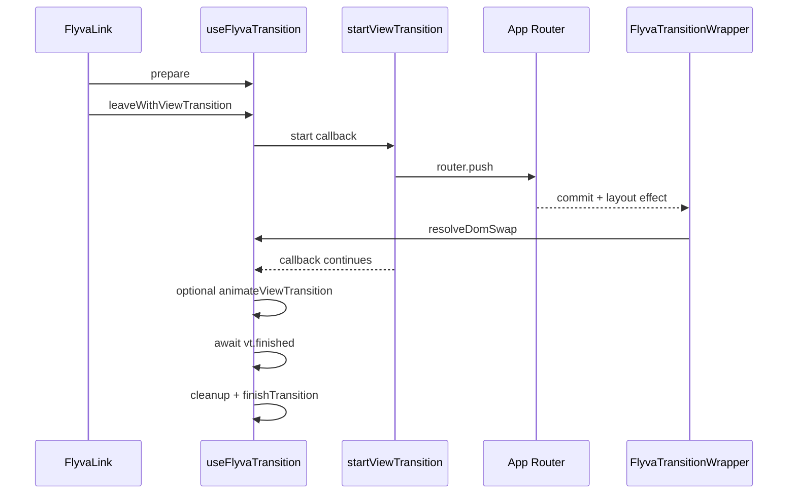
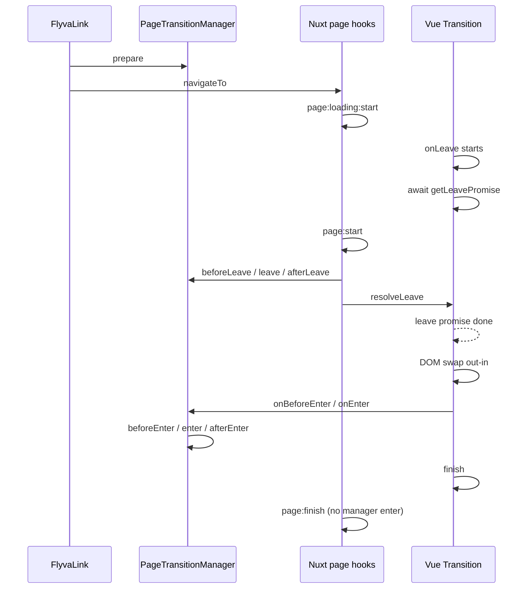
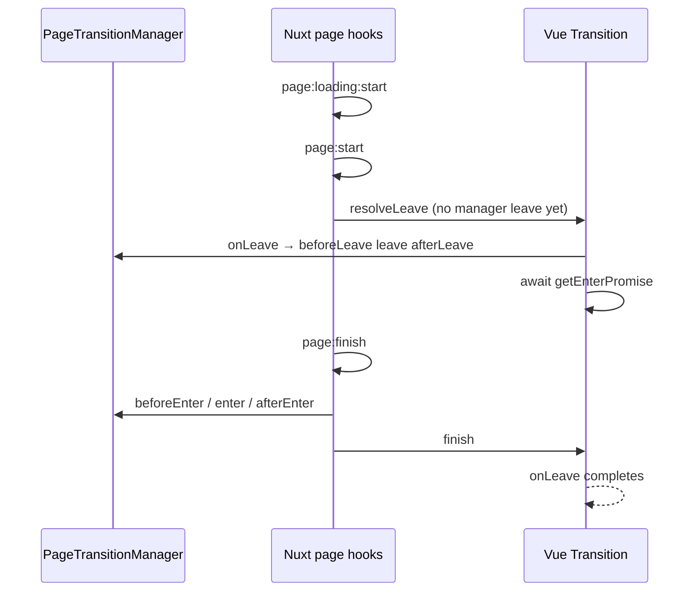
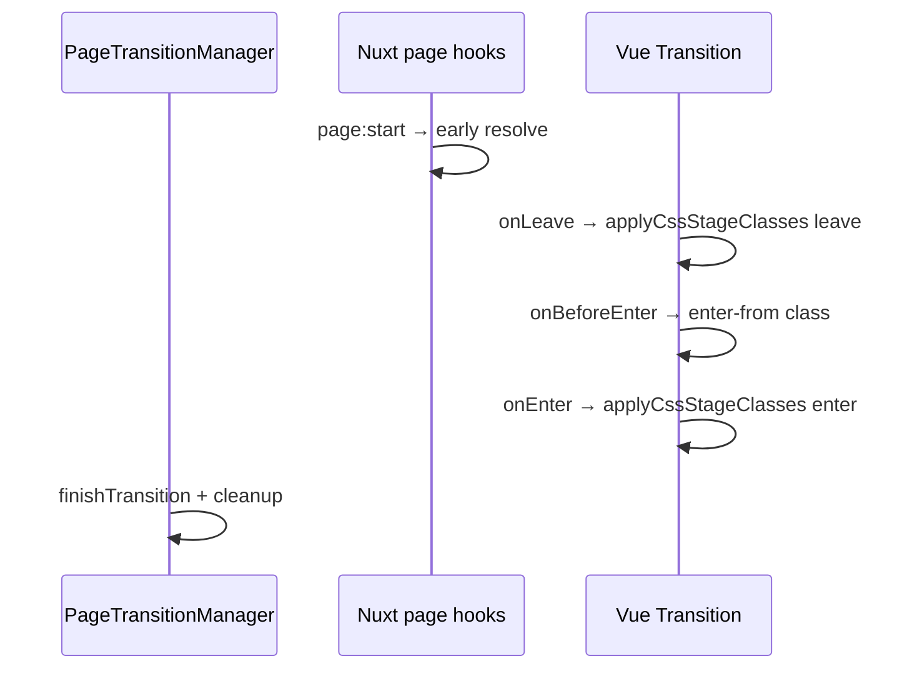
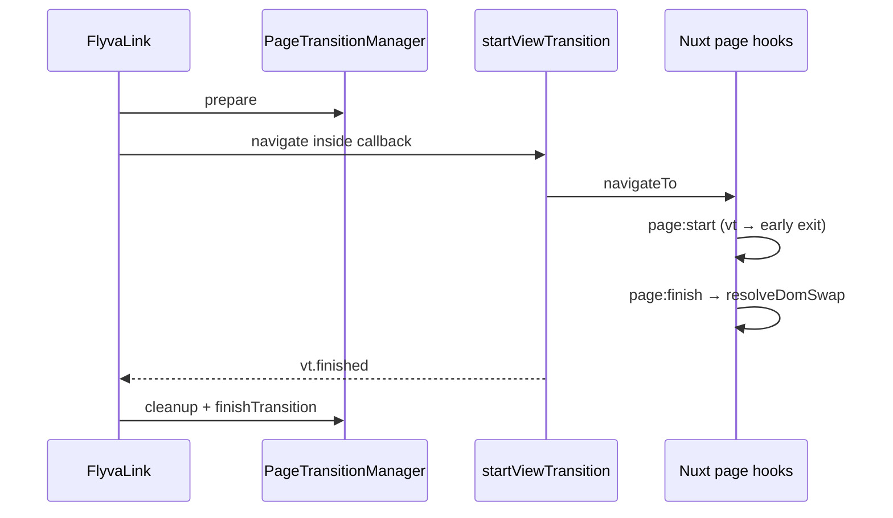

# Lifecycle vs framework

How Flyva’s **PageTransition** hooks line up with **Next.js (App Router)** and **Nuxt 4** mechanics. Diagrams are aligned with the current adapters (`FlyvaLink`, `FlyvaTransitionWrapper`, `FlyvaPage`).

## Shared transition contract

The manager always runs hooks in this order for a single navigation (names match `PageTransitionStage`):



`cleanup` is invoked from `finishTransition()` after `afterEnter` (or earlier on VT / some CSS paths). **CSS mode** and **View Transitions** skip or replace the `leave` / `enter` **animation** work but still use the same overall navigation ordering.

---

## Next.js - default (sequential JS)

`leave()` is **awaited** before `router.push`. The new RSC payload renders; `FlyvaTransitionWrapper` reacts to `pathname` in a layout effect and calls `enter()`.



---

## Next.js - `concurrent: true`

`leave()` is **not** awaited; navigation runs immediately. `prepare` inserts a **clone** of the content root; `leave` animates the clone as `current`. After swap, `enter` runs on the real new content.

This clone exists because the App Router does not keep two React trees alive for overlap - see [Next.js - concurrent mode and content cloning](../next#concurrent-mode-and-content-cloning) for layout shift, replayed CSS, and ref caveats, or use [View Transitions](./view-transitions) instead.



---

## Next.js - CSS mode (`cssMode`, no app VT)

`leave()` runs **CSS class phases** on the current content only; then `router.push`. After navigation, the wrapper adds `enter-from`, then `enter()` runs **enter** CSS phases and finishes the transition.



---

## Next.js - View Transitions (`config.viewTransition`)

Navigation runs inside `document.startViewTransition`. The callback calls `router.push` and **awaits** a DOM-swap promise; the wrapper’s layout effect calls `resolveDomSwap()`. VT cleanup runs after `vt.finished`.



---

## Nuxt - default (sequential JS, `out-in`)

`FlyvaLink` calls `prepare` then `navigateTo`. **page:start** runs `beforeLeave` → `leave` → `afterLeave` **only when the manager is already running** (i.e. `prepare` ran); it always calls `resolveLeave()` so the leave promise from **page:loading:start** completes. Plain navigation (e.g. `NuxtLink` with `:flyva="false"`) never calls `prepare`, so **page:start** skips those manager hooks and only releases the leave gate. Vue’s `<Transition>` **onLeave** first **awaits** that leave promise, then the old page is torn down (`out-in`). **onEnter** runs `beforeEnter` → `enter` → `afterEnter` when a transition is active, then `finish()` (resolves the enter promise). **page:finish** on the sequential path only awaits the leave promise and does not run the manager enter again.



---

## Nuxt - `concurrent: true`

**page:start** skips manager leave but still calls `resolveLeave()` so the sequential leave gate is released. **onLeave** runs `beforeLeave` / `leave` / `afterLeave`, then **awaits getEnterPromise()**. Manager **enter** runs in **page:finish**, then `finish()` resolves the enter promise so **onLeave** can complete.



---

## Nuxt - CSS mode (`cssMode`, `flyva.viewTransition` off)

**page:start** resolves the leave gate without running manager JS leave. **onLeave** runs **CSS leave** classes only. **onBeforeEnter** adds `*-enter-from`; **onEnter** runs **CSS enter** classes, then `finishTransition` and `finish`.



---

## Nuxt - View Transitions (`flyva.viewTransition`)

`FlyvaLink` drives `startViewTransition` and sets **vt active**. **page:start** / **page:finish** short-circuit Flyva’s normal leave/enter when `isVtActive()`. **page:finish** calls `resolveDomSwap` so the VT callback can proceed.



---

## Lifecycle CSS classes on `<html>`

At each stage change, `PageTransitionManager` calls `applyLifecycleClasses` on `document.documentElement` (`<html>`): **prefixed phase classes** (Barba / Vue style), plus continuity helpers and a **data attribute** for the active transition key.

### Class timeline

```
beforeLeave  →  add: {prefix}-running, {prefix}-leave, {prefix}-leave-active
leave        →  remove: {prefix}-leave;  add: {prefix}-leave-to
afterLeave   →  remove: {prefix}-leave-active, {prefix}-leave-to;  add: {prefix}-pending
beforeEnter  →  remove: {prefix}-pending;  add: {prefix}-enter, {prefix}-enter-active
enter        →  remove: {prefix}-enter;  add: {prefix}-enter-to
afterEnter   →  remove: {prefix}-enter-active, {prefix}-enter-to   ({prefix}-running still on)
none         →  remove all lifecycle classes (including {prefix}-running, {prefix}-pending)
```

- **`{prefix}-running`** — present from the first leave stage through `afterEnter`, cleared only when the manager reaches `none` / `finishTransition`. Use it for “whole swap” UI (progress bars, dimming chrome) without losing state in the gap between leave and enter.
- **`{prefix}-pending`** — present only between **`afterLeave`** and **`beforeEnter`**, when leave hooks are done but enter has not started yet (often overlaps route resolution / DOM swap). Keeps a hook for continuous styling between `*-leave-active` and `*-enter-active`.

### `data-flyva-transition`

While a transition is in progress (any stage except `none`), `<html>` also gets:

```html
<html data-flyva-transition="defaultTransition" class="flyva-running flyva-leave-active …">
```

The value is the **string key** of the running transition in your map (`run(name, …)` / `flyva-transition` prop). It is removed when the swap finishes. Import **`FLYVA_TRANSITION_DATA_ATTR`** from `@flyva/shared` if you want the attribute name as a constant.

**Why it’s useful:** you can target one transition in CSS without touching transition code, e.g. hide a global nav progress indicator when `data-flyva-transition="overlayTransition"` because that transition draws its own overlay.

The default class prefix is `flyva`. Configure it via `lifecycleClassPrefix` in config:

::: code-group

```tsx [Next.js]
<FlyvaRoot transitions={transitions} config={{ lifecycleClassPrefix: 'app' }}>
```

```ts [Nuxt (nuxt.config.ts)]
export default defineNuxtConfig({
  flyva: { lifecycleClassPrefix: 'app' },
})
```

:::

### Use cases

**Disable interactions for the whole swap:**

```css
html.flyva-running {
  pointer-events: none;
  cursor: wait;
}
```

**Per-transition overrides (with `data-flyva-transition`):**

```css
html.flyva-running[data-flyva-transition='overlayTransition'] .global-progress {
  display: none;
}
```

**Prevent scroll while `running`:**

```css
html.flyva-running {
  overflow: hidden;
}
```

Phase classes (`flyva-leave-active`, `flyva-enter-active`, etc.) still reflect the manager stage. **`flyva-running`** and **`data-flyva-transition`** apply across JS hooks, CSS mode, and View Transitions for anything driven by the shared manager.

**Note:** The bundled playgrounds style a wait cursor via **`html.flyva-running::after`** in global CSS so it tracks the same **`flyva-running`** span as the library - no extra classes from transition hooks are required for that pattern.

---

## See also

- [Transition modes overview](./index)
- [Writing transitions](../transitions)
- [CSS mode](./css-mode) · [View Transitions](./view-transitions)
