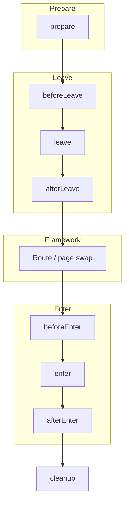
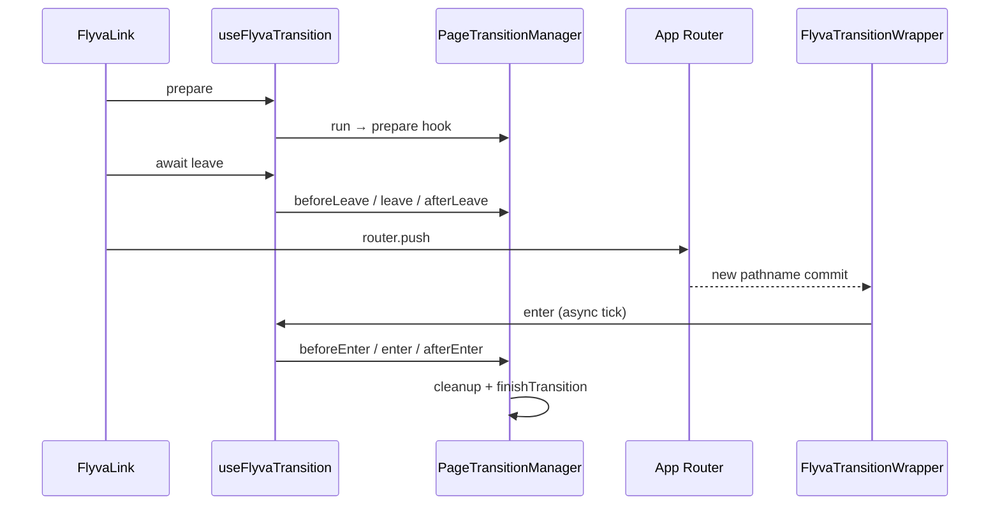
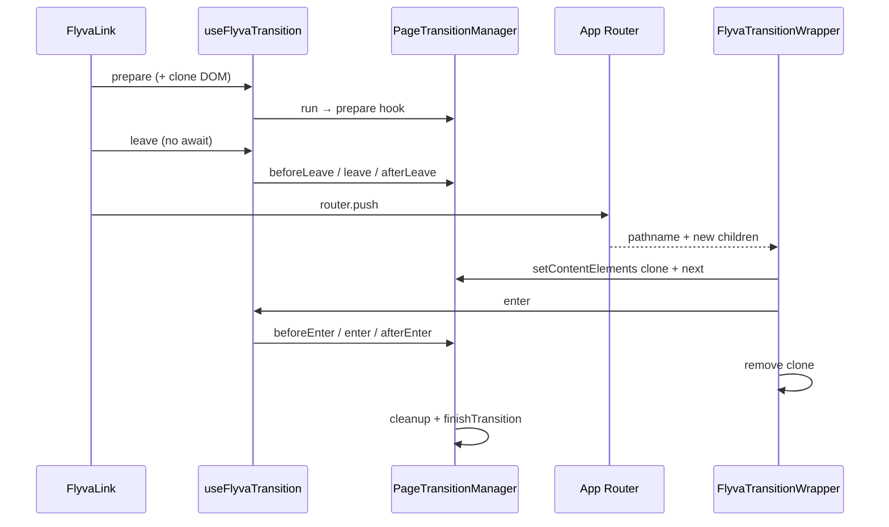
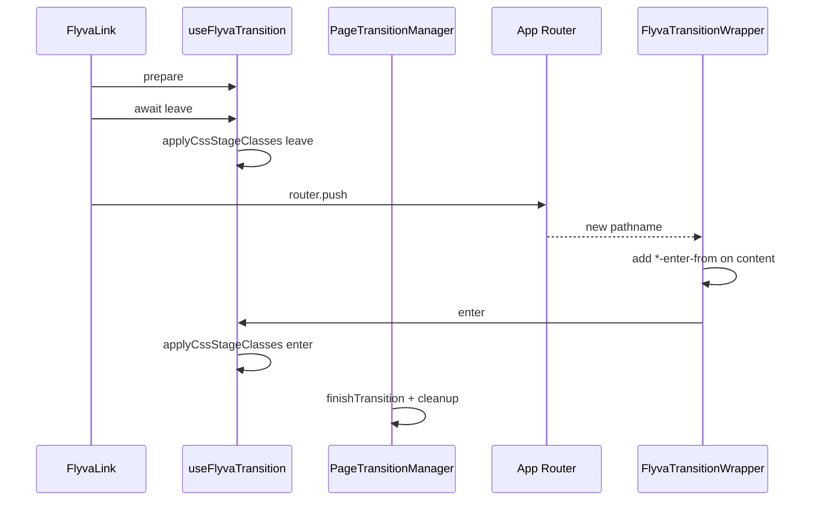

# Transition modes (Next.js)

::: tip If you also know Nuxt
**`concurrent: true`** is the sharpest behavioral split: on **Next.js (App Router)** Flyva **clones** the swap subtree so leave can run while `router.push` commits; on **Nuxt**, overlap is handled by **`FlyvaPage` / Vue `<Transition>`** without that clone. Cloning affects layout, replayed CSS motion, and which DOM node `context.current` refers to during leave. See [Transition modes (Nuxt)](/guide/nuxt/transition-modes) and [Nuxt overview](/guide/nuxt/).
:::

Flyva always uses the same `PageTransition` lifecycle and `FlyvaLink` flow. **How** the outgoing and incoming views are animated depends on the mode you choose:

| Mode | You implement | Best when |
|------|----------------|-----------|
| **JS hooks** (default) | `leave` / `enter` (and other hooks) with any animation library | Full control, complex timelines, FLIP, imperative logic |
| **CSS mode** | Styles for generated `*-leave-*` / `*-enter-*` classes | Lightweight fades/slides, no JS animation dependency |
| **View Transitions** | Optional `viewTransitionNames`, `animateViewTransition`, plus CSS for `::view-transition-*` | Native cross-document feel, shared-element–style transitions in supporting browsers |

Only one animation path runs per navigation. Enabling **View Transitions** in app config changes how navigation is wrapped (`document.startViewTransition`); **`cssMode: true`** on a transition defers animation to those CSS class phases instead of your `leave`/`enter` (when VT is off). The [CSS mode](#css-mode) section below and the dedicated [View Transition API](/guide/next/view-transition-api) page expand on constraints.

## JS-based mode (default)

With neither `cssMode` nor app-level View Transitions, Flyva runs your hooks in order: `prepare` → `beforeLeave` → `leave` → … → `enter` → `afterEnter` → `cleanup`. You animate with anime.js, GSAP, Motion, Web Animations API, or manual `requestAnimationFrame`.

- **Sequential (default)** — `leave` finishes before the route updates, then `enter` runs on the new page.
- **`concurrent: true`** — leave can overlap navigation; the adapter keeps the old pixels on screen with a **DOM clone** before `router.push` while the new tree mounts. Prefer `context.current` and `context.next` for the exact swap roots. On the **App Router**, concurrent mode is **fragile** because of cloning - layout shift, replayed CSS motion, and broken ref assumptions are common; see [Concurrent mode and content cloning](/guide/next/#concurrent-mode-and-content-cloning) or use the [View Transition API](/guide/next/view-transition-api) for a native swap.

Patterns, `context.el`, options, and recipes live in [Writing transitions](/guide/next/writing-transitions).

## CSS mode (short)

Set `cssMode: true` on the transition. Flyva applies a fixed class sequence on the content root (`myTransition-leave-from`, `myTransition-leave-active`, …) and waits for CSS transitions/animations to finish. Your `leave` / `enter` hooks are **not** used for the animated phases (dev warns if you define them anyway).

Keep **`viewTransition: false`** (or unset) on `FlyvaRoot` `config` so this path is used. Full naming, examples, and edge cases: [CSS mode](#css-mode) below.

## View Transitions (short)

Pass `viewTransition: true` on `FlyvaRoot`’s `config`. `FlyvaLink` then performs navigation inside `document.startViewTransition`. On the transition object you can set `viewTransitionNames` (selector → `view-transition-name`) and optionally `animateViewTransition` after `vt.ready`.

`concurrent` does not apply in this path. Full setup: [View Transition API](/guide/next/view-transition-api).

## Where to read next

- [Lifecycle vs App Router](#lifecycle-vs-framework) — Mermaid sequences: hooks vs mechanics per mode
- [Writing transitions](/guide/next/writing-transitions) — interface, class pattern, options, recipes (overlay, FLIP)
- [CSS mode](#css-mode) — class phases and CSS examples
- [View Transition API](/guide/next/view-transition-api) — config, naming map, flow, shared helpers

---

## Lifecycle vs framework

How Flyva’s **PageTransition** hooks line up with **Next.js (App Router)** mechanics. Diagrams are aligned with the current adapter (`FlyvaLink`, `FlyvaTransitionWrapper`).

### Shared transition contract

The manager always runs hooks in this order for a single navigation (names match `PageTransitionStage`):



`cleanup` is invoked from `finishTransition()` after `afterEnter` (or earlier on VT / some CSS paths). **CSS mode** and **View Transitions** skip or replace the `leave` / `enter` **animation** work but still use the same overall navigation ordering.

---

### Next.js - default (sequential JS)

`leave()` is **awaited** before `router.push`. The new RSC payload renders; `FlyvaTransitionWrapper` reacts to `pathname` in a layout effect and calls `enter()`.



---

### Next.js - `concurrent: true`

`leave()` is **not** awaited; navigation runs immediately. `prepare` inserts a **clone** of the content root; `leave` animates the clone as `current`. After swap, `enter` runs on the real new content.

This clone exists because the App Router does not keep two React trees alive for overlap - see [Concurrent mode and content cloning](/guide/next/#concurrent-mode-and-content-cloning) for layout shift, replayed CSS, and ref caveats, or use the [View Transition API](/guide/next/view-transition-api) instead.



---

### Next.js - CSS mode (`cssMode`, no app VT)

`leave()` runs **CSS class phases** on the current content only; then `router.push`. After navigation, the wrapper adds `enter-from`, then `enter()` runs **enter** CSS phases and finishes the transition.



---

## Lifecycle CSS classes on `<html>`

At each stage change, `PageTransitionManager` calls `applyLifecycleClasses` on `document.documentElement` (`<html>`): **prefixed phase classes** (Barba / Vue style), plus continuity helpers and a **data attribute** for the active transition key.

### Class timeline

```
beforeLeave  →  add: {prefix}-running, {prefix}-leave, {prefix}-leave-active
leave        →  remove: {prefix}-leave;  add: {prefix}-leave-to
afterLeave   →  remove: {prefix}-leave-active, {prefix}-leave-to;  add: {prefix}-pending
beforeEnter  →  remove: {prefix}-pending;  add: {prefix}-enter, {prefix}-enter-active
enter        →  remove: {prefix}-enter;  add: {prefix}-enter-to
afterEnter   →  remove: {prefix}-enter-active, {prefix}-enter-to   ({prefix}-running still on)
none         →  remove all lifecycle classes (including {prefix}-running, {prefix}-pending)
```

- **`{prefix}-running`** — present from the first leave stage through `afterEnter`, cleared only when the manager reaches `none` / `finishTransition`. Use it for “whole swap” UI (progress bars, dimming chrome) without losing state in the gap between leave and enter.
- **`{prefix}-pending`** — present only between **`afterLeave`** and **`beforeEnter`**, when leave hooks are done but enter has not started yet (often overlaps route resolution / DOM swap). Keeps a hook for continuous styling between `*-leave-active` and `*-enter-active`.

### `data-flyva-transition`

While a transition is in progress (any stage except `none`), `<html>` also gets:

```html
<html data-flyva-transition="defaultTransition" class="flyva-running flyva-leave-active …">
```

The value is the **string key** of the running transition in your map (`run(name, …)` / `flyvaTransition` prop). It is removed when the swap finishes. Import **`FLYVA_TRANSITION_DATA_ATTR`** from `@flyva/shared` if you want the attribute name as a constant.

**Why it’s useful:** you can target one transition in CSS without touching transition code, e.g. hide a global nav progress indicator when `data-flyva-transition="overlayTransition"` because that transition draws its own overlay.

The default class prefix is `flyva`. Configure it via `lifecycleClassPrefix` in config:

```tsx
<FlyvaRoot transitions={transitions} config={{ lifecycleClassPrefix: 'app' }}>
```

### Use cases

**Disable interactions for the whole swap:**

```css
html.flyva-running {
  pointer-events: none;
  cursor: wait;
}
```

**Per-transition overrides (with `data-flyva-transition`):**

```css
html.flyva-running[data-flyva-transition='overlayTransition'] .global-progress {
  display: none;
}
```

**Prevent scroll while `running`:**

```css
html.flyva-running {
  overflow: hidden;
}
```

Phase classes (`flyva-leave-active`, `flyva-enter-active`, etc.) still reflect the manager stage. **`flyva-running`** and **`data-flyva-transition`** apply across JS hooks, CSS mode, and View Transitions for anything driven by the shared manager.

**Note:** The bundled playgrounds style a wait cursor via **`html.flyva-running::after`** in global CSS so it tracks the same **`flyva-running`** span as the library - no extra classes from transition hooks are required for that pattern.

---

## CSS mode

In CSS mode Flyva drives **leave** and **enter** by adding and removing utility classes on the animated content root. You write CSS (or Tailwind `@apply`) against those classes; you do not implement `leave` / `enter` for the actual motion (and should omit them to avoid confusion - the dev build warns if they are present with `cssMode: true`).

### Enable on the transition

```ts
export const fadeCss = {
  cssMode: true,
  // prepare / beforeLeave / cleanup still run if you need them
};
```

The transition **key** (e.g. `fadeCss`) becomes the **prefix** for all generated class names.

### App configuration (Next.js)

CSS mode is used when **View Transitions** are **not** enabled at the app level — do not set `viewTransition: true` on `FlyvaRoot` `config` (or leave it falsy).

### Class sequence

Helpers in `@flyva/shared` (`applyCssStageClasses`) run this pattern for each phase:

**Leave**

1. Add `{name}-leave-from` and `{name}-leave-active`
2. Remove `{name}-leave-from`, add `{name}-leave-to`
3. Wait for transitions/animations on the element (or timeout)
4. Remove `{name}-leave-active` and `{name}-leave-to`

**Enter**

1. Add `{name}-enter-from` and `{name}-enter-active`
2. Remove `{name}-enter-from`, add `{name}-enter-to`
3. Wait, then remove `{name}-enter-active` and `{name}-enter-to`

Here `{name}` is the registered transition name (e.g. `slideTransition`).

### Example CSS

```css
.slideTransition-leave-active,
.slideTransition-enter-active {
  transition: opacity 0.35s ease, transform 0.35s ease;
}

.slideTransition-leave-from,
.slideTransition-enter-to {
  opacity: 1;
  transform: translateX(0);
}

.slideTransition-leave-to,
.slideTransition-enter-from {
  opacity: 0;
  transform: translateX(12px);
}
```

Target the **content root** inside `FlyvaTransitionWrapper`.

### Related API

- `@flyva/shared`: `applyCssStageClasses`, `waitForAnimation`
- [Writing transitions](/guide/next/writing-transitions) for shared hooks like `prepare` and `cleanup`
- [Transition modes overview](#transition-modes-next-js) (this page) for how CSS mode fits next to JS and View Transitions
- [View Transition API](/guide/next/view-transition-api) — browser VT wiring, `viewTransitionNames`, helpers
