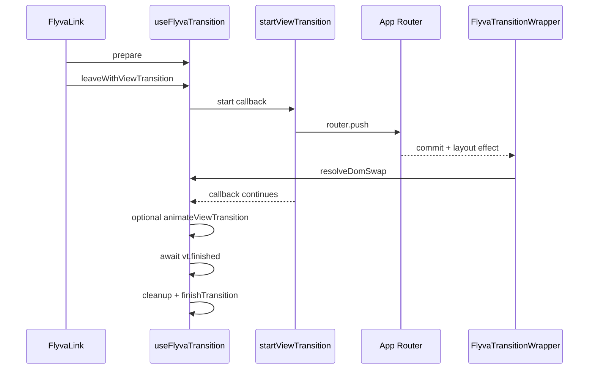

# View Transition API (Next.js)

When View Transitions mode is on, `FlyvaLink` wraps navigation in the browser’s **`document.startViewTransition`** API. The old and new views participate in a single cross-fade (and you can assign `view-transition-name` to elements for shared-element–style effects).

## Adapter sequence (Next.js)

Navigation runs inside `document.startViewTransition`. The callback calls `router.push` and **awaits** a DOM-swap promise; the wrapper’s layout effect calls `resolveDomSwap()`. VT cleanup runs after `vt.finished`.

## Requirements

- A browser that supports the [View Transitions API](https://developer.mozilla.org/en-US/docs/Web/API/View_Transitions_API) (check with `supportsViewTransitions()` from `@flyva/shared`).
- View Transitions enabled in Flyva app config (below).

## Enable in the app

Pass `viewTransition: true` on `FlyvaRoot`’s `config` prop (alongside `defaultKey` and any other options).

## Transition object

Optional fields on `PageTransition`:

| Field | Purpose |
|-------|---------|
| `viewTransitionNames` | `Record<string, string>` or `(context) => Record<string, string>` mapping **pseudo-element names** to **CSS selectors**. Flyva sets `element.style.viewTransitionName` for each match before the transition snapshot. |
| `animateViewTransition` | `(vt, context) => Promise<void>` - runs after `vt.ready` if you need custom work alongside the default transition. |

During the navigation, **`context.viewTransition`** is the `ViewTransition` instance (see `PageTransitionContext` in `@flyva/shared`).

## Flow (simplified)

1. User clicks `FlyvaLink`; `prepare` runs as usual.
2. `startViewTransition` is called; inside the callback the app navigates and Flyva coordinates DOM swap resolution (`resolveDomSwap`).
3. If `viewTransitionNames` is set, names are applied (and cleared after `finished`).
4. If `animateViewTransition` exists, it runs after `vt.ready`.
5. When finished, cleanup runs and internal VT state resets.

**`concurrent: true`** has no effect while View Transitions mode is active (the manager warns in development).

## Helpers (`@flyva/shared`)

- `supportsViewTransitions()` — feature detect
- `applyViewTransitionNames(names, context)` — resolve map or callback, assign names, return map for later cleanup
- `clearViewTransitionNames(resolvedMap)` — clear assigned names

CSS for `::view-transition-old(root)`, `::view-transition-new(root)`, and named groups follows standard MDN documentation.

## Related

- [Transition modes](/guide/next/transition-modes) — how VT fits next to JS hooks and CSS mode
- [Writing transitions](/guide/next/writing-transitions)
- [@flyva/shared API](/api/shared) — types and `view-transition` exports
