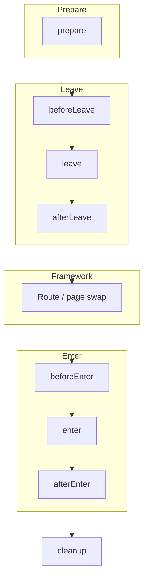
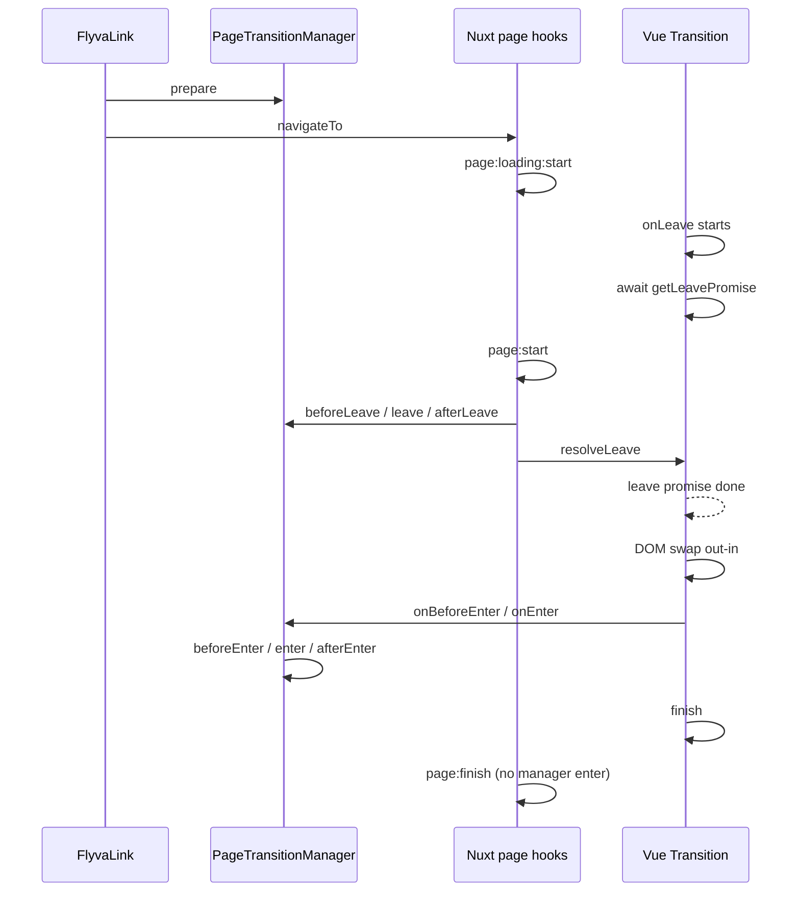
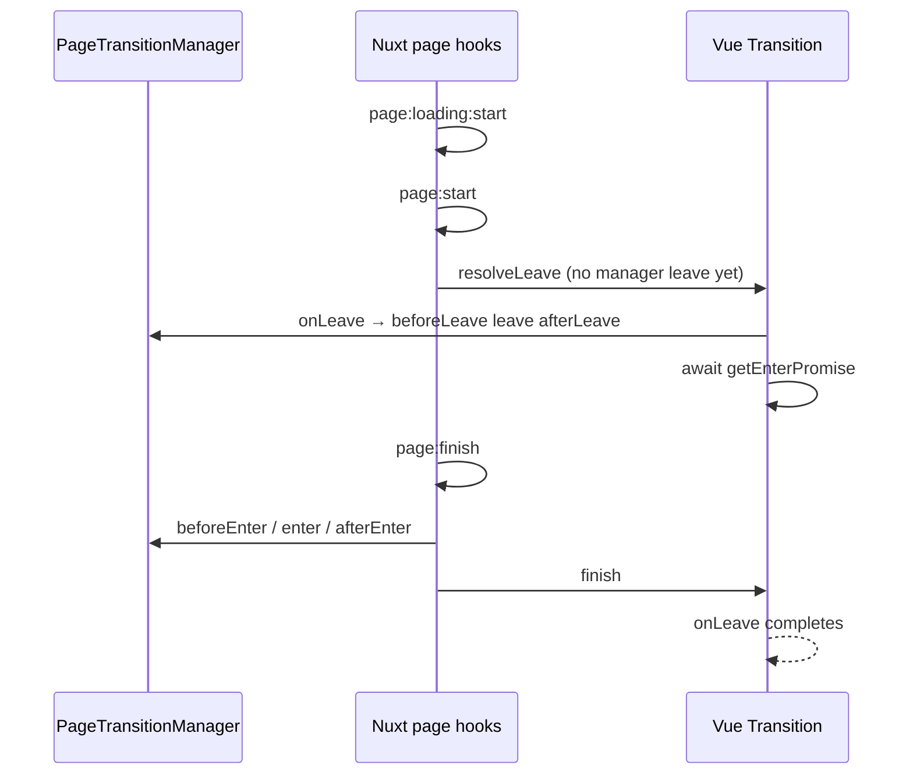
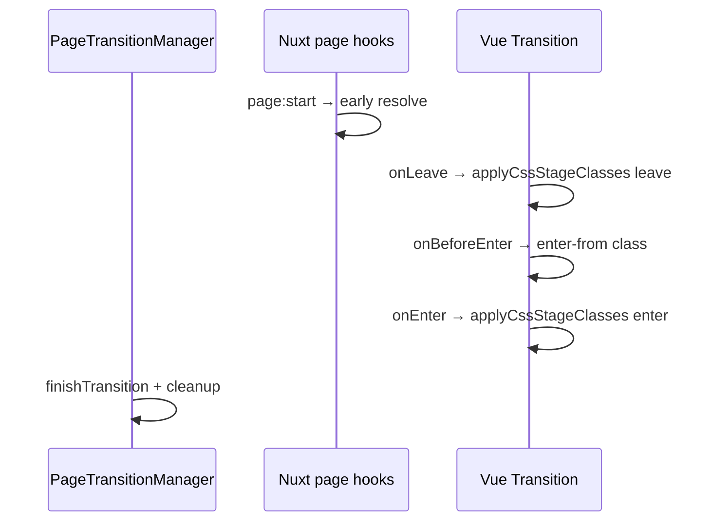

# Transition modes (Nuxt)

::: tip If you also know Next.js
**`concurrent: true`** behaves differently on **Next.js (App Router)**: Flyva **clones** the swap subtree so leave can run while the route commits. **Nuxt** overlaps leave/navigation via **`FlyvaPage` / Vue `<Transition>`** without that clone. If you port mental models from Next, re-read `context.current` / template ref timing here and in [Writing transitions (Nuxt)](/guide/nuxt/writing-transitions). [Next overview](/guide/next/).
:::

Flyva always uses the same `PageTransition` lifecycle and `FlyvaLink` flow. **How** the outgoing and incoming views are animated depends on the mode you choose:

| Mode | You implement | Best when |
|------|----------------|-----------|
| **JS hooks** (default) | `leave` / `enter` (and other hooks) with any animation library | Full control, complex timelines, FLIP, imperative logic |
| **CSS mode** | Styles for generated `*-leave-*` / `*-enter-*` classes | Lightweight fades/slides, no JS animation dependency |
| **View Transitions** | Optional `viewTransitionNames`, `animateViewTransition`, plus CSS for `::view-transition-*` | Native cross-document feel, shared-element–style transitions in supporting browsers |

Only one animation path runs per navigation. Enabling **View Transitions** in module config changes how navigation is wrapped (`document.startViewTransition`); **`cssMode: true`** on a transition defers animation to those CSS class phases instead of your `leave`/`enter` (when Flyva VT is off). The [CSS mode](#css-mode) section below and the dedicated [View Transition API](/guide/nuxt/view-transition-api) page expand on constraints.

## JS-based mode (default)

With neither `cssMode` nor Flyva-level View Transitions, Flyva runs your hooks in order: `prepare` → `beforeLeave` → `leave` → … → `enter` → `afterEnter` → `cleanup`. You animate with anime.js, GSAP, Motion, Web Animations API, or manual `requestAnimationFrame`.

- **Sequential (default)** — `leave` finishes before the new page is shown (`out-in` with Vue `<Transition>`), then `enter` runs on the new page.
- **`concurrent: true`** — leave can overlap navigation; **`FlyvaPage`** coordinates Vue `<Transition>` timing so old and new roots are tracked without a DOM clone. Prefer `context.current` and `context.next` for the exact swap roots.

Patterns, `context.el`, options, and recipes live in [Writing transitions](/guide/nuxt/writing-transitions).

## CSS mode (short)

Set `cssMode: true` on the transition. Flyva applies a fixed class sequence on the content root (`myTransition-leave-from`, `myTransition-leave-active`, …) and waits for CSS transitions/animations to finish. Your `leave` / `enter` hooks are **not** used for the animated phases (dev warns if you define them anyway).

Requires **`flyva.viewTransition`** to be **off** for this path on link navigations (see module behavior). Full naming, examples, and edge cases: [CSS mode](#css-mode) below.

## View Transitions (short)

Set `viewTransition: true` in **`flyva`** module options. `FlyvaLink` then performs navigation inside `document.startViewTransition`. On the transition object you can set `viewTransitionNames` (selector → `view-transition-name`) and optionally `animateViewTransition` after `vt.ready`.

`concurrent` does not apply in this path. If Nuxt’s global `app.viewTransition` is also on, disable one stack to avoid conflicts. Full setup: [View Transition API](/guide/nuxt/view-transition-api).

## Where to read next

- [Lifecycle vs Nuxt](#lifecycle-vs-framework) — Mermaid sequences: hooks vs mechanics per mode
- [Writing transitions](/guide/nuxt/writing-transitions) — interface, class pattern, options, recipes (overlay, FLIP)
- [CSS mode](#css-mode) — class phases and CSS examples
- [View Transition API](/guide/nuxt/view-transition-api) — config, naming map, flow, shared helpers

---

## Lifecycle vs framework

How Flyva’s **PageTransition** hooks line up with **Nuxt 4** mechanics. Diagrams are aligned with the current adapter (`FlyvaLink`, `FlyvaPage`).

### Shared transition contract

The manager always runs hooks in this order for a single navigation (names match `PageTransitionStage`):



`cleanup` is invoked from `finishTransition()` after `afterEnter` (or earlier on VT / some CSS paths). **CSS mode** and **View Transitions** skip or replace the `leave` / `enter` **animation** work but still use the same overall navigation ordering.

---

### Nuxt - default (sequential JS, `out-in`)

`FlyvaLink` calls `prepare` then `navigateTo`. **page:start** runs `beforeLeave` → `leave` → `afterLeave` **only when the manager is already running** (i.e. `prepare` ran); it always calls `resolveLeave()` so the leave promise from **page:loading:start** completes. Plain navigation (e.g. `NuxtLink` with `:flyva="false"`) never calls `prepare`, so **page:start** skips those manager hooks and only releases the leave gate. Vue’s `<Transition>` **onLeave** first **awaits** that leave promise, then the old page is torn down (`out-in`). **onEnter** runs `beforeEnter` → `enter` → `afterEnter` when a transition is active, then `finish()` (resolves the enter promise). **page:finish** on the sequential path only awaits the leave promise and does not run the manager enter again.



---

### Nuxt - `concurrent: true`

**page:start** skips manager leave but still calls `resolveLeave()` so the sequential leave gate is released. **onLeave** runs `beforeLeave` / `leave` / `afterLeave`, then **awaits getEnterPromise()**. Manager **enter** runs in **page:finish**, then `finish()` resolves the enter promise so **onLeave** can complete.



---

### Nuxt - CSS mode (`cssMode`, `flyva.viewTransition` off)

**page:start** resolves the leave gate without running manager JS leave. **onLeave** runs **CSS leave** classes only. **onBeforeEnter** adds `*-enter-from`; **onEnter** runs **CSS enter** classes, then `finishTransition` and `finish`.



---

## Lifecycle CSS classes on `<html>`

At each stage change, `PageTransitionManager` calls `applyLifecycleClasses` on `document.documentElement` (`<html>`): **prefixed phase classes** (Barba / Vue style), plus continuity helpers and a **data attribute** for the active transition key.

### Class timeline

```
beforeLeave  →  add: {prefix}-running, {prefix}-leave, {prefix}-leave-active
leave        →  remove: {prefix}-leave;  add: {prefix}-leave-to
afterLeave   →  remove: {prefix}-leave-active, {prefix}-leave-to;  add: {prefix}-pending
beforeEnter  →  remove: {prefix}-pending;  add: {prefix}-enter, {prefix}-enter-active
enter        →  remove: {prefix}-enter;  add: {prefix}-enter-to
afterEnter   →  remove: {prefix}-enter-active, {prefix}-enter-to   ({prefix}-running still on)
none         →  remove all lifecycle classes (including {prefix}-running, {prefix}-pending)
```

- **`{prefix}-running`** — present from the first leave stage through `afterEnter`, cleared only when the manager reaches `none` / `finishTransition`. Use it for “whole swap” UI (progress bars, dimming chrome) without losing state in the gap between leave and enter.
- **`{prefix}-pending`** — present only between **`afterLeave`** and **`beforeEnter`**, when leave hooks are done but enter has not started yet (often overlaps route resolution / DOM swap). Keeps a hook for continuous styling between `*-leave-active` and `*-enter-active`.

### `data-flyva-transition`

While a transition is in progress (any stage except `none`), `<html>` also gets:

```html
<html data-flyva-transition="defaultTransition" class="flyva-running flyva-leave-active …">
```

The value is the **string key** of the running transition in your map (`run(name, …)` / `flyva-transition` prop). It is removed when the swap finishes. Import **`FLYVA_TRANSITION_DATA_ATTR`** from `@flyva/shared` if you want the attribute name as a constant.

**Why it's useful:** you can target a specific transition in CSS without touching transition code, e.g. hide global navigation during only one of the sequences.

The default class prefix is `flyva`. Configure it via `lifecycleClassPrefix` in config:

```ts
export default defineNuxtConfig({
  flyva: { lifecycleClassPrefix: 'app' },
})
```

### Use cases

**Disable interactions for the whole swap:**

```css
html.flyva-running {
  pointer-events: none;
  cursor: wait;
}
```

**Per-transition overrides (with `data-flyva-transition`):**

```css
html.flyva-running[data-flyva-transition='overlayTransition'] .global-progress {
  display: none;
}
```

**Prevent scroll while `running`:**

```css
html.flyva-running {
  overflow: hidden;
}
```

Phase classes (`flyva-leave-active`, `flyva-enter-active`, etc.) still reflect the manager stage. **`flyva-running`** and **`data-flyva-transition`** apply across JS hooks, CSS mode, and View Transitions for anything driven by the shared manager.

**Note:** The bundled playgrounds style a wait cursor via **`html.flyva-running::after`** in global CSS so it tracks the same **`flyva-running`** span as the library - no extra classes from transition hooks are required for that pattern.


## CSS mode

In CSS mode Flyva drives **leave** and **enter** by adding and removing utility classes on the animated content root. You write CSS (or Tailwind `@apply`) against those classes; you do not implement `leave` / `enter` for the actual motion (and should omit them to avoid confusion - the dev build warns if they are present with `cssMode: true`).

### Enable on the transition

```ts
export const fadeCss = {
  cssMode: true,
  // prepare / beforeLeave / cleanup still run if you need them
};
```

The transition **key** (e.g. `fadeCss`) becomes the **prefix** for all generated class names.

### App configuration (Nuxt)

CSS mode is used when **View Transitions** are **not** enabled at the app level.

Keep `flyva.viewTransition` unset/false. If `flyva.viewTransition` is true, Nuxt’s Flyva integration routes animation through the View Transitions path instead of the CSS class path for link navigations.

### Class sequence

Helpers in `@flyva/shared` (`applyCssStageClasses`) run this pattern for each phase:

**Leave**

1. Add `{name}-leave-from` and `{name}-leave-active`
2. Remove `{name}-leave-from`, add `{name}-leave-to`
3. Wait for transitions/animations on the element (or timeout)
4. Remove `{name}-leave-active` and `{name}-leave-to`

**Enter**

1. Add `{name}-enter-from` and `{name}-enter-active`
2. Remove `{name}-enter-from`, add `{name}-enter-to`
3. Wait, then remove `{name}-enter-active` and `{name}-enter-to`

Here `{name}` is the registered transition name (e.g. `slideTransition`).

### Example CSS

```css
.slideTransition-leave-active,
.slideTransition-enter-active {
  transition: opacity 0.35s ease, transform 0.35s ease;
}

.slideTransition-leave-from,
.slideTransition-enter-to {
  opacity: 1;
  transform: translateX(0);
}

.slideTransition-leave-to,
.slideTransition-enter-from {
  opacity: 0;
  transform: translateX(12px);
}
```

Target the **content root** the adapter animates — the element Flyva passes through Vue’s `<Transition>` on Nuxt.

### Nuxt and `FlyvaPage`

`FlyvaPage` runs the leave class phase inside `onLeave` and the enter phase in `onEnter` / `onBeforeEnter` depending on the active transition. With `cssMode` and without Flyva View Transitions, the page hook path resolves leave early so the DOM can swap, then completes enter styling on the new page.

### Related API

- `@flyva/shared`: `applyCssStageClasses`, `waitForAnimation`
- [Writing transitions](/guide/nuxt/writing-transitions) for shared hooks like `prepare` and `cleanup`
- [View Transition API](/guide/nuxt/view-transition-api) — browser VT wiring, `viewTransitionNames`, helpers
